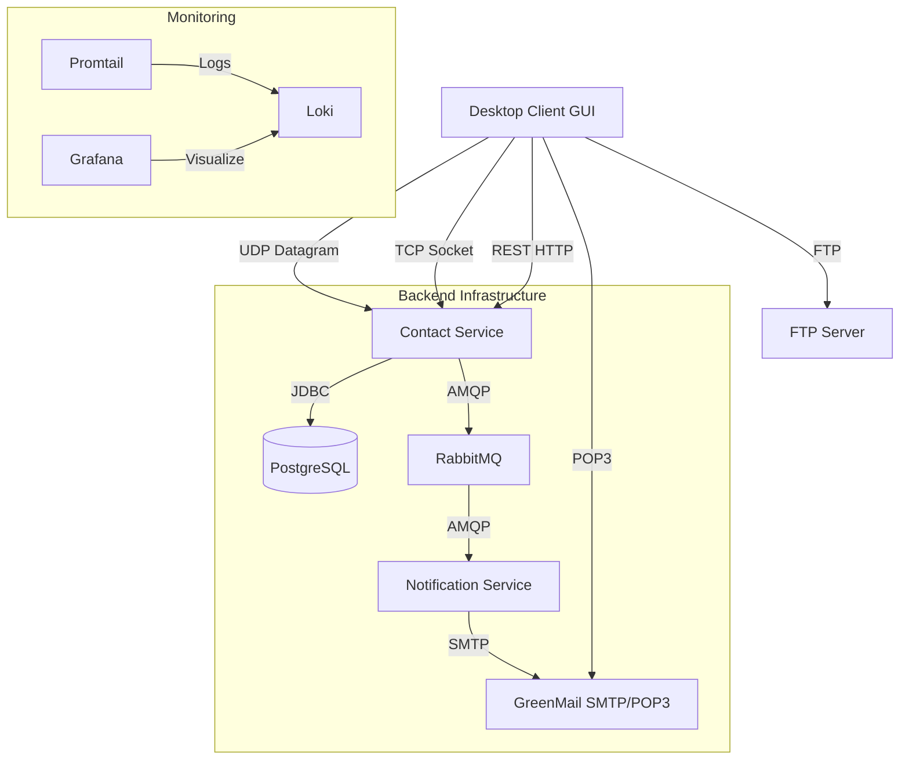

# Secure Enterprise Contact System (SECS)

A robust, distributed system for managing contacts and users, built with **Java 23** and **Spring Boot 3**, utilizing a **Microservices Architecture**. The project demonstrates advanced networking protocols, security standards (RBAC, AES Encryption), and DevOps practices (Docker, CI/CD, Monitoring).


## 🏗 System Architecture

The system consists of two backend microservices, a comprehensive infrastructure stack, and a Java Swing Desktop Client.



## 🚀 Key Features & Protocols

This project implements **5 Application Layer Protocols** and enterprise-grade features:

### 1. Networking Protocols
* **HTTP (REST API)**: Used for all CRUD operations (Contacts, Users), Authentication, and External API integration.
* **TCP**: Implemented a custom socket server (`port 8888`) for real-time server status monitoring (Health Check) displayed in the GUI footer.
* **UDP**: Implemented a datagram listener (`port 9999`) for high-speed, fire-and-forget audit logging.
* **SMTP**: Asynchronous email dispatch via RabbitMQ & `notification-service` to **GreenMail**.
* **POP3**: The Desktop Client connects directly to the mail server to fetch and read user emails.
* **FTP**: Full integration with **vsftpd** server allowing users to upload files, share documents, and backup the database.

### 2. Security (RBAC & Encryption)
* **AES Encryption**: Sensitive data (Contact Address) is encrypted/decrypted on the fly before database persistence.
* **Authentication**: Custom Login/Registration system with **BCrypt** password hashing.
* **Role-Based Access Control (RBAC)**:
    * **ADMIN**: Full access, User management (Delete/Reset Password), DB Backup.
    * **USER**: Limited access (Email, FTP only).
* **Password Policy**: Admin can force users to change their password upon next login.

### 3. Advanced Integration
* **External API**: Integrated with `Agify.io` to automatically predict contact age based on the name if not provided.
* **Message Broker**: Decoupled architecture using **RabbitMQ** for asynchronous communication between services.

### 4. DevOps & Monitoring
* **Dockerized**: The entire stack runs with a single `docker-compose up`.
* **Observability**: Complete logging stack with **Grafana + Loki + Promtail**.
* **CI/CD**: GitHub Actions pipeline for automated building and unit testing.

## 🛠 Tech Stack

| Component | Technology |
| :--- | :--- |
| **Language** | Java 23 (JDK 23) |
| **Framework** | Spring Boot 3.2 (Web, Data JPA, Security, AMQP, Validation) |
| **Database** | PostgreSQL 15 |
| **Messaging** | RabbitMQ |
| **Mail Server** | GreenMail (SMTP/POP3/IMAP) |
| **File Server** | vsftpd (FTP) |
| **Frontend** | Java Swing (Desktop Application) |
| **Monitoring** | Grafana, Loki, Promtail |

## ⚙️ Installation & Setup

### Prerequisites
* Docker Desktop (running)
* Java JDK 23
* Maven

### 1. Start Infrastructure
Start all containers (Database, RabbitMQ, Mail, FTP, Monitoring):
```bash
docker-compose up -d
```

### 2. Run Microservices
Start the backend services using IntelliJ or Terminal:
1.  `ContactServiceApplication` (Port 8080) - *Core Logic*
2.  `NotificationServiceApplication` (Port 8081) - *Email Worker*

### 3. Run Client
Run `ClientApp.java` in the `desktop-client` module.

## 📖 Usage Guide

### Default Credentials
| Role | Username | Password | Email (System) |
| :--- | :--- | :--- | :--- |
| **Admin** | `admin` | `admin123` | `admin@localhost` |
| **User** | `user` | `user123` | `user@localhost` |

*Note: Upon first login as 'user', the system will enforce a password change.*

### Features Walkthrough
1.  **Login/Register**: Create a new account or log in with existing credentials.
2.  **Contacts (Admin)**: Add a contact. Notice `Address` is encrypted in DB but readable in UI. Note `Age` is auto-fetched from external API if left '0'.
3.  **Email**: Go to "Mail". Use Autocomplete to find users. Send an email. Go to "Inbox", click "Fetch (POP3)" to read it.
4.  **FTP**: Upload a file from your disk. Click "Refresh List" to see it on the server. Share files via email automatically.
5.  **TCP Monitor**: Check the bottom bar. It shows "Server TCP: OK" (Green) if the backend is alive.

## 📊 Monitoring (Grafana)
Access Grafana at `http://localhost:3000` (User: `admin`, Pass: `admin`).
Navigate to **Explore** -> Select **Loki** -> Query `{job="varlogs"}` to see real-time application logs.

---
*Project created for University Course
*